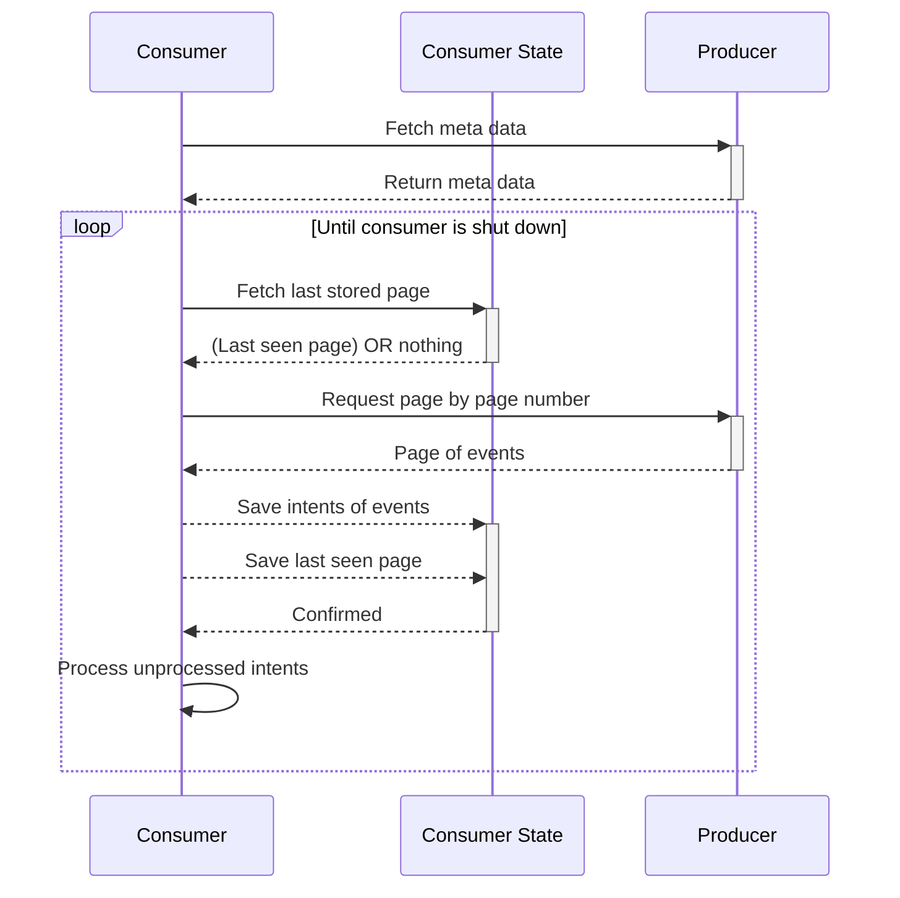

# Consumer design

The consumer library offers helpers for consuming events from a event producer.

Things to consider:

- resilient fetching of new events
- persisting the last seen page
- mapping events to new data/actions

This library should not try to do too much but focus on tools to make it easier to fetch events and action on them.

## How

The consumer needs to store on it's side what the last page it processed was, and for the last page, what events have already been seen. This page number + previous events are represented as *page* in the diagram.

The word [intents](https://devonburriss.me/reliability-with-intents/) here refers to the data needed to indicate to a machine what it should do with this event. This could be a **command**. Typically, these would be processed using an [Outbox pattern](https://microservices.io/patterns/data/transactional-outbox.html).